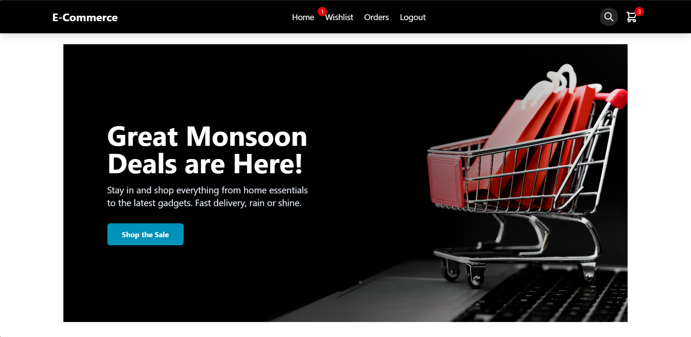

# Full-Stack E-Commerce Platform

A complete, modern e-commerce website built with a decoupled architecture using Django for the backend and React for the frontend. This application features user authentication, a dynamic product catalog, a persistent shopping cart and wishlist, and real-time payment processing with Razorpay.

**Live Demo:**
* **Frontend (Netlify):** [https://ecommercegovind.netlify.app](https://ecommercegovind.netlify.app)
* **Backend API (Render):** [https://ecommerce-nbi6.onrender.com/api/products/](https://ecommerce-nbi6.onrender.com/api/products/)

---

## Features

-   **User Authentication:** Secure user registration and login system using JSON Web Tokens (JWT) for session management.
-   **Product Catalog & Search:** Browse a complete product list and use the dynamic search bar to filter products by name or description.
-   **Shopping Cart:** A fully functional, backend-driven cart that persists across devices for logged-in users. Add, remove, and update item quantities.
-   **Wishlist:** A backend-powered wishlist to save favorite items for later.
-   **Secure Checkout:** Integrated with **Razorpay** for a seamless and secure payment process.
-   **Order History:** Users can view their past orders in a dedicated dashboard.
-   **Responsive Design:** A mobile-first design with a hamburger menu ensures a great user experience on any device.
-   **Cloud Media Storage:** Product images are hosted on **Cloudinary**, a global CDN, for fast and optimized delivery.
-   **Production Ready:** Deployed with a professional setup using Render for the backend and Netlify for the frontend.

---

## Tech Stack

### Backend
-   **Framework:** Django
-   **API:** Django REST Framework (DRF)
-   **Authentication:** Simple JWT (JSON Web Tokens)
-   **Database:** PostgreSQL
-   **Image Storage:** Cloudinary
-   **CORS:** django-cors-headers
-   **Server:** Gunicorn

### Frontend
-   **Library:** React
-   **Styling:** Tailwind CSS
-   **Routing:** React Router
-   **API Communication:** Axios
-   **State Management:** React Context API
-   **Build Tool:** Vite

### Deployment
-   **Backend Hosting:** Render
-   **Frontend Hosting:** Netlify
-   **Database Hosting:** PostgreSQL

---

## Showcase

**Homepage Banner**



---

**Product Listing**


---

**Search Functionality**


---

**Shopping Cart**


---

**Secure Checkout with Razorpay**


---

**User Dashboard & Order History**


---

## Setup and Installation

To run this project locally, you will need to set up both the backend and frontend.

### Backend Setup

1.  **Clone the repository:**
    ```bash
    git clone [https://github.com/your-username/your-repo-name.git](https://github.com/your-username/your-repo-name.git)
    cd your-repo-name/backend
    ```

2.  **Create and activate a virtual environment:**
    ```bash
    # For Windows
    python -m venv venv
    .\venv\Scripts\activate

    # For macOS/Linux
    python3 -m venv venv
    source venv/bin/activate
    ```

3.  **Install dependencies:**
    ```bash
    pip install -r requirements.txt
    ```

4.  **Create a `.env` file** in the `backend` root directory and add your local database and secret keys:
    ```env
    # .env file for backend
    SECRET_KEY=your-very-secret-django-key
    DEBUG=True
    ALLOWED_HOSTS=127.0.0.1,localhost

    # Local PostgreSQL Credentials
    DB_NAME=your_local_db_name
    DB_USER=your_local_db_user
    DB_PASSWORD=your_local_db_password
    DB_HOST=localhost
    DB_PORT=5432

    # Cloudinary Credentials
    CLOUDINARY_CLOUD_NAME=your_cloud_name
    CLOUDINARY_API_KEY=your_api_key
    CLOUDINARY_API_SECRET=your_api_secret

    # Razorpay Credentials (use test keys for local development)
    RAZORPAY_KEY_ID=your_razorpay_test_key_id
    RAZORPAY_KEY_SECRET=your_razorpay_test_key_secret
    ```

5.  **Run database migrations:**
    ```bash
    python manage.py migrate
    ```

6.  **Create a superuser** to access the admin panel:
    ```bash
    python manage.py createsuperuser
    ```

7.  **Start the Django server:**
    ```bash
    python manage.py runserver
    ```
    The backend will be running at `http://127.0.0.1:8000`.

### Frontend Setup

1.  **Navigate to the frontend directory:**
    ```bash
    cd ../frontend 
    ```

2.  **Install dependencies:**
    ```bash
    npm install
    ```

3.  **Create a `.env` file** in the `frontend` root directory and add the local API URL:
    ```env
    # .env file for frontend
    VITE_API_URL=[http://127.0.0.1:8000/api](http://127.0.0.1:8000/api)
    ```

4.  **Start the React development server:**
    ```bash
    npm run dev
    ```
    The frontend will be running at `http://localhost:5173`.